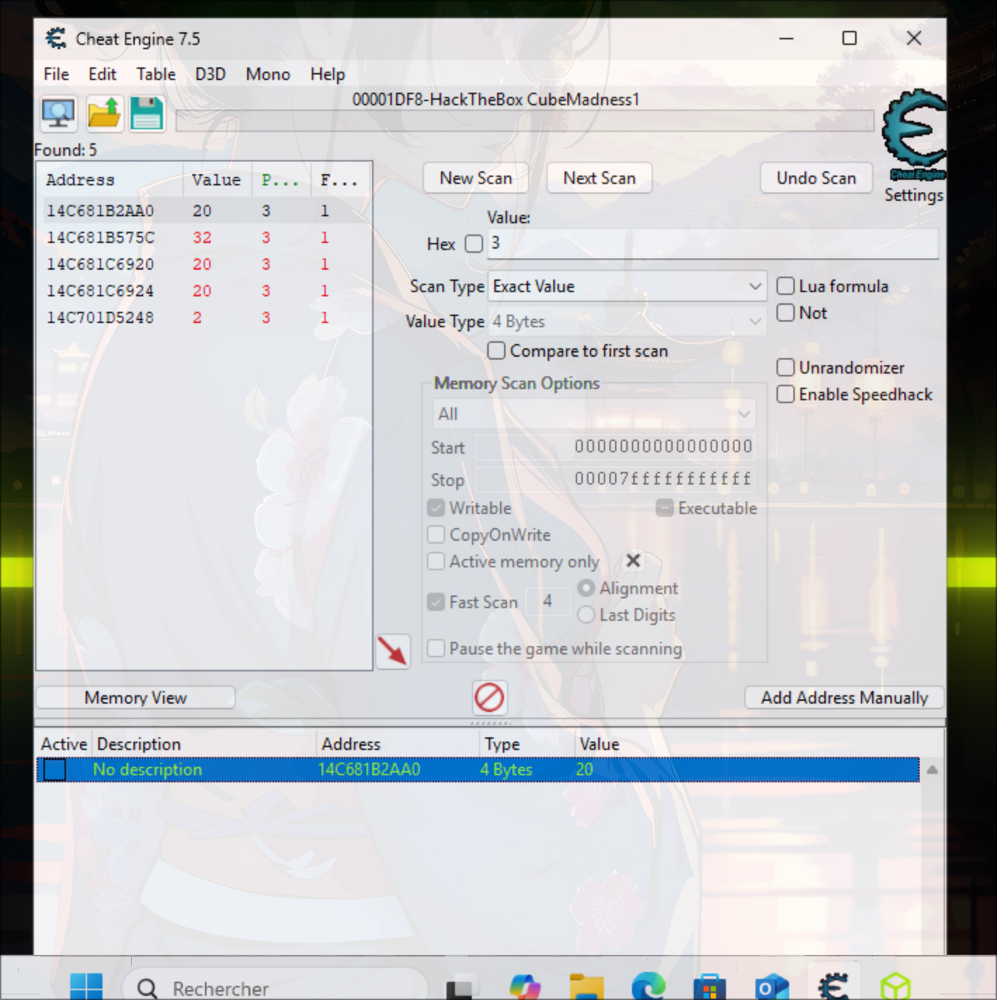
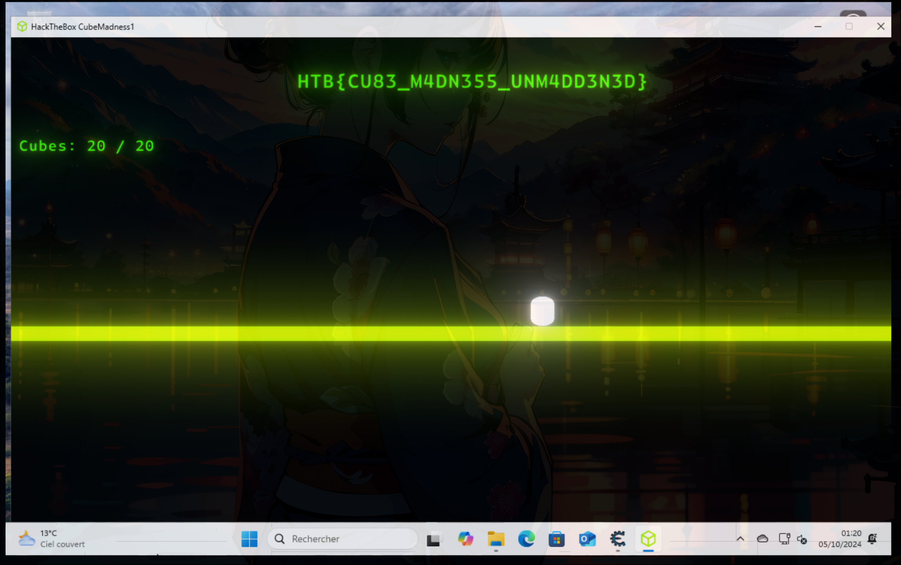

# Cube Madness - Nerumir

> Nous sommes face à un fichier `PE` (Portable Executable). Donc un executable `Windows`. Je lance une VM Windows et je l'execute pour voir que c'est un jeu. Il y a un compteur de cubes récupérés. On a un personnage et on peut récupérer des cubes. Cependant, il est impossible de terminer le compteur et de récolter `20` cubes comme demandé.

- J'aurais pu essayer de faire de l'analyse statique avec `DNSpy` par exemple mais je n'y ai pas pensé.. J'ai ouvert le programme avec `Ghidra` mais ça n'a rien donné. De manière générale je trouve `Ghidra` bien plus performant pour les fichiers `ELF` (executables `Linux`). En revanche, `DNSpy` est très bien pour les fichiers `PE`.
- Du coup j'utilise cheatengine, un logiciel d'analyse dynamique de la mémoire, ce qui signifie qu'il vient directement analyser la mémoire d'un processus en cours d'execution. Je trouve l'adresse mémoire qui stocke la quantité de cubes récupérés via une série de scans en modifiant la valeur. Donc on procède par filtrage. Puis je trouve `5` adresses et je modifie le nombre pour que ça fasse `20` :

- Ce qui me permet de récupérer le flag :

 

> [!TIP]
> Parfois, l'analyse dynamique, bien que plus gourmande en ressource, nous permet d'avoir des informations plus facilement que par décortiquage du programme en analyse statique. Il est certains que le flag pouvait se retrouver par analyse statique mais ce n'était pas le but de ce challenge et la tâche aurait pu être plus fastidieuse. Aillez tout de même le bon reflexe d'excuter la commande `strings` sur le programme pour voir si il est possible d'obtenir le flag directement, notamment lorsqu'il est stocké en tant que chaîne de caractère "en dure" dans le programme.
