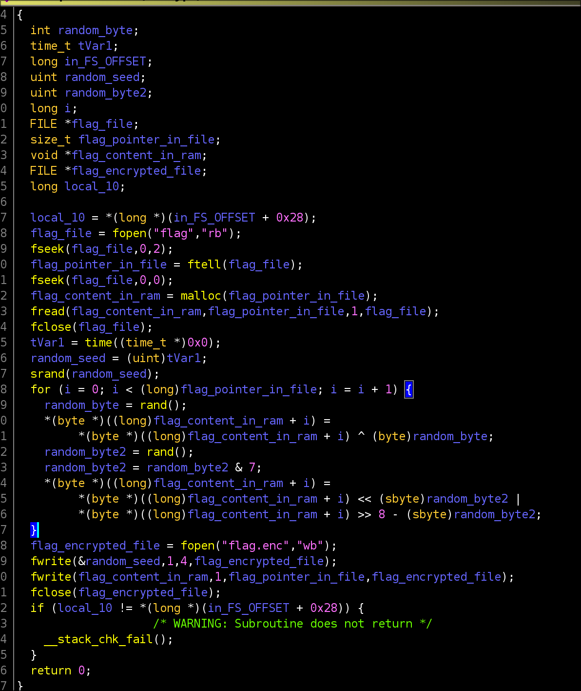
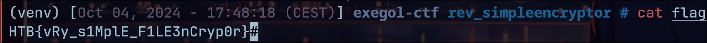

# Simple Encryptor - Nerumir

> On a deux fichiers, un fichier qui contient des données binaires qui sont supposément le flag à décrypter, et un programme qui sert à le crypter.

- J'ouvre le programme avec `Ghidra` et je vois que c'est un programme codé en `C`. Je renomme alors toutes les variables de la version décompilée pour qu'elle soit lisible :



- Je vois qu'il y a deux opérations qui sont faites sur chaque octet du flag. Le flag est dans un fichier, il est lu et stocké dans le `heap` (malloc) et puis octet par octet, il est lu et une transformation est appliqué à l'octet, avant de passer au suivant. Cette transformation se déroule en 2 étapes. Un `XOR` avec un nombre généré aléatoirement et puis un décalage de `bits` avec un autre nombre généré aléatoirement.
- La fonction aléatoire utilisée est `rand()` qui est une fonction de `stdlib.c`. Cette fonction génère un nombre aléatoire basé sur une seed qui est établie avec la fonction `srand()` que l'on voit également dans la décompilation. On voit également que la seed est ajoutée au fichier de sortie flag.enc. Ce qui signifie qu'on on y a accès (4 premiers octets du fichier flag.enc). On peut alors regénérer ces nombres pseudo aléatoires très facilement en rechargeant simplement cette même seed. Ensuite, il faut XOR (pour les mêmes raisons que le challenge précédent) et ensuite appliquer le décalage inverse de bits. La valeur binaire du flag sera alors restituée à son état d'origine.
- Je fais alors un programme en `C` qui fait exactement cela, voici les 2 modifications importantes "d'inversion". Le reste du programme est identique à celui décompilé :

```c
 rand_for_xor = rand();
 padding = rand();
 padding = padding & 7;
 
 flag_byte[i] = (flag_byte[i] >> padding) | (flag_byte[i] << (8 - padding)); 
 flag_byte[i] = flag_byte[i] ^ rand_for_xor;
```

- Nous obtenons alors le flag :



> [!TIP]
> L'opération `XOR` est très souvent utilisée en cryptographie et est un élément de base de la majorité des algorithmes de chiffrement symétrique. Lorsqu'une faille de sécurité existe dans l'implémentation d'un algorithme de chiffrement symétrique, il est très fréquent que l'exploitation implique l'utilisation de la commutativité de cet opérateur avec le fait que l'inverse d'un élément est lui même : `A ^ A = 0`.
