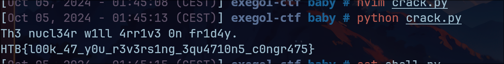

# Baby Encryption- Nerumir

- On a un message chiffré ainsi que le code qui a permis de le chiffrer.

Voici le code : 

```python
import string
from secret import MSG

def encryption(msg):
    ct = []
    for char in msg:
        ct.append((123 * char + 18) % 256)
    return bytes(ct)

ct = encryption(MSG)
f = open('./msg.enc','w')
f.write(ct.hex())
f.close()
```

- Il faut juste connaître un peu l'opérateur modulaire. L'inverse de `123` dans l'anneau `Z/256Z` est `179`. Ainsi, il faut annuler d'abord l'addition et ensuite la multiplication. Donc voici l'algorithme de déchiffrement : 

```python
def decryption(ct):
    msg = ""
    for byte in ct:
        msg += chr((179 * (byte - 18)) % 256)
    return msg

ct_hex = open('./msg.enc', 'r').read()
ct = bytes.fromhex(ct_hex)
msg = decryption(ct)
print(msg)
```

- Je run mon script et j'ai le flag :

 

> [!WARNING]
> Vous allez beaucoup travailler avec l'opérateur modulaire en cryptographie, donc avec les anneaux `Z/nZ`. Il faut savoir que les éléments qui admettent un inverse dans ces groupes sont uniquement les éléments premiers avec `n`. Lorsque ce n'est pas le cas, pas de panique, chaque nombre peut revenir à son état initial via des cycles de multiplications. Ces cycles sont des sous-groupes cycliques, c'est à dire qu'ils sont générés par un seul élément et la loi multiplicative. Par exemple si c'était `2`, alors il aurait suffit de multiplier par `2` autant de fois que nécessaire pour retomber sur `0` et on a notre sous-groupe. La fonction de décryptage aurait donc été en autant d'étapes que d'éléments du groupe. `4` est dans ce sous-groupe cyclique. Donc en multipliant `4` par lui même dans `Z/256Z`, on aurait également obtenu tout le sous-groupe, même si on aurait pas obtenu les éléments dans le même ordre qu'avec `2` comme générateur.
