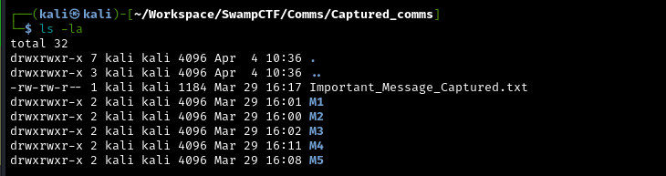
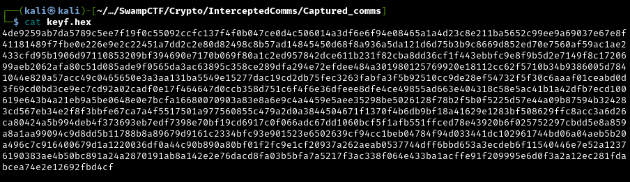
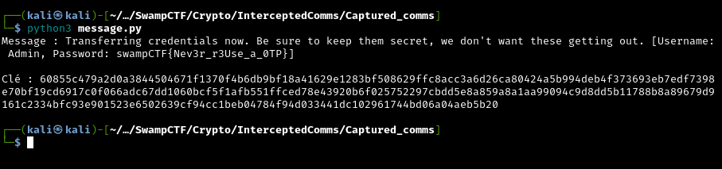

# Intercepted communications - dtss

Au départ nous avons **[plusieurs dossiers](data/Captured_comms.zip)** avec dedans : Deux fichiers **textes** contenants des **représentations binaires**. L'un pour le **plaintext** et l'autre pour son **cipher**. Nous avons également un dernier message important, le message chiffré (Important_Message_Captured.txt) sans sa version déchiffré.



Et une **Consigne** : 

> "We were able to listen in on our oponnents for a while, and managed to capture the ciphertexts and plaintexts of their communication, but were eventually kicked out. I'll send you a dump of what we managed to get so far, but long story short, there are pairs of encrypted and decrypted communications. We have reason to believe they're not following otp-imal security practices, and the most valualbe communication should be happening any second now. I'll link the file below. Good luck."

Je suis un peu **bloqué** au début de ce challenge et je me demande avec quelle méthode les messages ont été **chiffrés**, en regardant à nouveau la consigne " We have reason to believe they're not following otp-imal security practices", je remarque le jeu de mot avec "One-Time Pad" (OTP).

> [!NOTE] 
> Je ne connais pas le détail du chiffrement OTP et je me renseigne sur son fonctionnement : 
> - La clé est aléatoire
> - Elle a la même longueur que le message
> - Cette clé est utilisée une seule fois ( One-Time ) 

```yml
# Fonctionnement du chiffrement :
cipher = plaintext XOR key
```

Il fonctionne avec un **XOR** entre le **plaintext** et la **key** 

-->  Donc si on connaît le **plaintext** et le **cipher** on peut retrouver la **key** :

```yml
key = plaintext XOR cipher
```

> On a dans les dossiers l'ordre des messages (M1,M2,M3,M4,M5)

--> Je fais un script python qui lit les messages chiffrés et déchiffrés de M1 à M5, calcule la clé avec l'opération juste au dessus et enregistre les clés en hex.
> Je précise que le plaintext et le ciphertext sont ici sous forme binaire.

```python
from pathlib import Path

messages = ["M1", "M2", "M3", "M4", "M5"]

for msg in messages:
    plaintext = Path(f"{msg}/decrypted.txt").read_text().strip()
    ciphertext = Path(f"{msg}/encrypted.txt").read_text().strip()
    
    key_bytes = bytes(
        int(plaintext[i:i+8], 2) ^ int(ciphertext[i:i+8], 2)
        for i in range(0, len(plaintext), 8)
    )
    
    Path(f"key_{msg}.hex").write_text(key_bytes.hex())
```

--> Je colle les morceaux de clés.

```python
k=b''.join([bytes.fromhex(open(f"key_M{i}.hex").read().strip()) for i in range(1,6)])
open("keyf.hex","w").write(k.hex())
```


--> Enfin, je fais un script qui teste toutes les **positions** possibles dans la **clé finale** pour peut être **déchiffrer** le **message** intercepté et donner la clé utilisée.

```python
def b2b(b): 
    return bytes(int(b[i:i+8], 2) for i in range(0, len(b), 8))

with open("Important_Message_Captured.txt") as f:
    c = b2b(f.read().strip())
with open("keyf.hex") as f:
    k = bytes.fromhex(f.read().strip())

for o in range(len(k) - len(c) + 1):
    p = bytes(a ^ b for a, b in zip(c, k[o:o+len(c)]))
    try:
        decoded = p.decode()
    except UnicodeDecodeError:
        continue
    print("Message :", decoded)
    print()
    print("Clé :", k[o:o+len(c)].hex())
    break
```

--> J'obtiens le message en clair et la clé :



Flag : ***swampCTF{Nev3r_r3Use_a_0TP}***

> [!IMPORTANT]
> Il me semblait important de laisser le flag en clair, car toute la logique de ce challenge repose sur lui. Nous avons pu déchiffrer le message intercepté parce que deux messages avaient la même longueur et utilisaient la même clé. L'algorithme OTP est sécurisé justement parce que, en temps normal la clé n'est utilisée qu'une seule fois.

