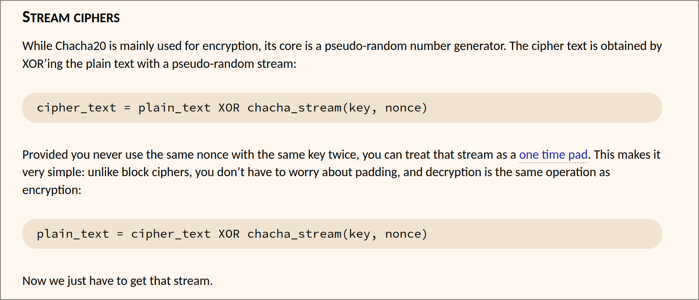
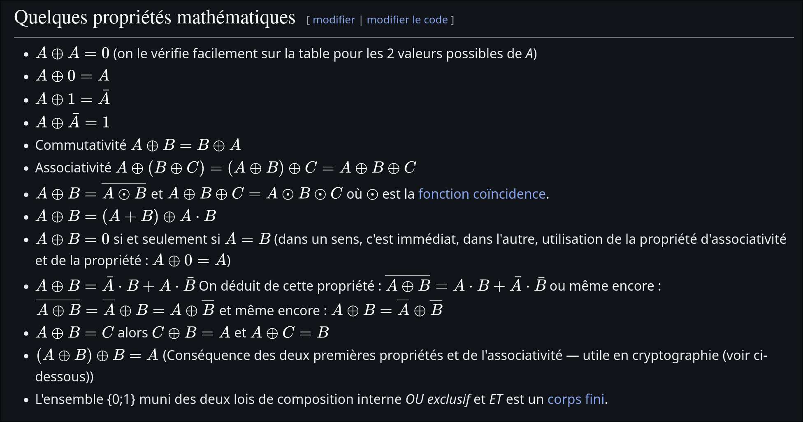
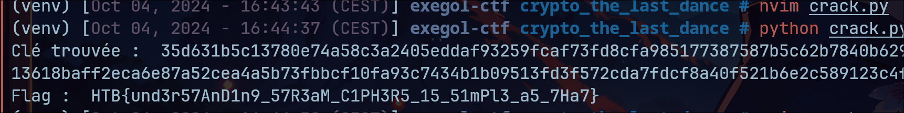

## The Last Chance - Nerumir

> On est face à un code Python qui chiffre avec l'algorithme chacha20 un message et le flag, avec la même clé et le même nonce. On a accès au message en clair et à sa version chiffrée. On a accès uniquement au flag chiffré. Le but est de trouver le flag.

- Je me renseigne sur le fonctionnement de l'algorithme `chacha20`, le problème est que je ne trouve aucun détail sur son fonctionnement et les articles parlent exclusivement de `chacha20-poly3015`, comme si `chacha20` tout seul était un sujet tabou... Je finis par trouver un article qui en parle et on créé une keystream à partir de la clé et un nonce (calculs cycliques par blocs pour augmenter l'entropie de la keystream générée). L'interaction avec le message à chiffrer est une opération `XOR` sur la valeur en binaire.



- Je me renseigne sur l'opérateur `XOR` et je remarque qu'il possède des propriétés mathématiques intéressantes, particulièrement l'associativité, et l'auto-symétrie. En gros :
  - Si `A XOR B = C`, alors `A XOR A XOR B = A XOR C` donc `B = A XOR C`.



- On exploite alors cette propriété et on déterminer la `keystream` en faisant un `XOR` du message en clair et de sa valeur chiffrée. On applique ensuite cette même propriété pour trouver le flag avec la `keystream` et sa valeur chiffrée. (D'ou le comportement symétrique de ce chiffremment).

- On trouve alors le flag :



Voici le code créé pour déchiffrer le flag : 

```python
def hexXor(hex1, hex2):
    n = min(len(hex1),len(hex2))
    res = bytes([x1 ^ x2 for x1, x2 in zip(bytes.fromhex(hex1), bytes.fromhex(hex2))])
    return res[:n].hex()


if __name__ == "__main__":
    message = b"Our counter agencies have intercepted your messages and a lot "
    message += b"of your agent's identities have been exposed. In a matter of "
    message += b"days all of them will be captured"

    iv = bytes.fromhex('c4a66edfe80227b4fa24d431')
    encrypted_message = '7aa34395a258f5893e3db1822139b8c1f04cfab9d757b9b9cca57e1df33d093f07c7f06e06bb6293676f9060a838ea138b6bc9f20b08afeb73120506e2ce7b9b9dcd9e4a421584cfaba2481132dfbdf4216e98e3facec9ba199ca3a97641e9ca9782868d0222a1d7c0d3119b867edaf2e72e2a6f7d344df39a14edc39cb6f960944ddac2aaef324827c36cba67dcb76b22119b43881a3f1262752990'

    # Réaliser une opération XOR entre le message chiffré et le message chiffré connu
    keystream = hexXor(message.hex(), encrypted_message)
    print("Clé trouvée : ", keystream)

    # Utiliser la clé trouvée pour décrypter le contenu
    flag = hexXor(keystream, '7d8273ceb459e4d4386df4e32e1aecc1aa7aaafda50cb982f6c62623cf6b29693d86b15457aa76ac7e2eef6cf814ae3a8d39c7')
    print('Flag : ', bytearray.fromhex(flag).decode())
```
