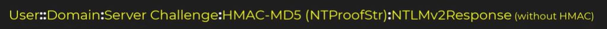

# MuddyWater - dtss

> Nous avons un fichier pcap et une consigne "We caught a threat actor, called MuddyWater, bruteforcing a login for our Domain Controller. We have a packet capture of the intrusion. Can you figure out what happened?"

## Analyse du trafic 

Pour commencer, j'ouvre le fichier avec **Wireshark**. Je me doute que le protocole d'authentification est **NTLM**, alors je filtre avec `ntlmssp`.

--> D'après la consigne je peux observer les tentatives de bruteforce du Domain Controller.

> Je dois trouver dans un premier temps quel compte a réussi à se connecter.

--> Je filtre avec smb2.cmd == 1 && smb2.nt_status == 0x00000000 pour trouver l'opération de session setup qui a réussi.


--> Un packet correspond c'est la trame 72074, j'observe que le user qui a réussi à se connecter est "hackbackzip"


> [!NOTE]
> Mon but va être de retrouver le mot de passe de "hackbackzip", je fais quelques recherches et je déduis qu'il va falloir reconstruire le hash Net-NTLMv2 de cet utilisateur puis le crack. Je tourne vers quelques outils pour m'aider.

Voici ma première reconstruction manuelle :

```User : hackbackzip

Domain : DESKTOP-0TNOE4V

Challenge : d102444d56e078f4

HMAC-MD5 : eb1b0afc1eef819c1dccd514c9623201

NTLMV2Response : eb1b0afc1eef819c1dccd514c962320101010000000000006f233d3d9f9edb01755959535466696d0000000002001e004400450053004b0054004f0050002d00300054004e0045003400560001001e004400450053004b

Hash : hackbackzip::DESKTOP-0TNOE4V:d102444d56e078f4:eb1b0afc1eef819c1dccd514c9623201:eb1b0afc1eef819c1dccd514c962320101010000000000006f233d3d9f9edb01755959535466696d0000000002001e004400450053004b
```
> Hash : hackbackzip::DESKTOP-0TNOE4V:d102444d56e078f4:eb1b0afc1eef819c1dccd514c9623201:eb1b0afc1eef819c1dccd514c962320101010000000000006f233d3d9f9edb01755959535466696d0000000002001e004400450053004b0054004f0050002d00300054004e004f0045003400560001001e004400450053004b0054004f0050002d00300054004e004f0045003400560004001e004400450053004b0054004f0050002d00300054004e004f0045003400560003001e004400450053004b0054004f0050002d00300054004e004f00450034005600070008006f233d3d9f9edb010900280063006900660073002f004400450053004b0054004f0050002d00300054004e004f004500340056000000000000000000

--> J'essaye de cracker ce hash mais il est invalide, en effet j'avais négligé le bon format du flag qui est User**::**Domain**:**Server:HMAC-MD5(Challenge)**:**NTLMV2Response(without HMAC)



> [!IMPORTANT]
> Mon erreur est le fait que j'ai inclus le HMAC-MD5 dans la réponse NTLMV2


Bon format de Hash :


```hackbackzip::DESKTOP-0TNOE4V:d102444d56e078f4:eb1b0afc1eef819c1dccd514c9623201:01010000000000006f233d3d9f9edb01755959535466696d0000000002001e004400450053004b0054004f0050002d00300054004e004f0045003400560001001e004400450053004b0054004f0050002d00300054004e004f0045003400560004001e004400450053004b0054004f0050002d00300054004e004f0045003400560003001e004400450053004b0054004f0050002d00300054004e004f00450034005600070008006f233d3d9f9edb010900280063006900660073002f004400450053004b0054004f0050002d00300054004e004f004500340056000000000000000000```

  

--> Je crack le hash avec cette commande : hashcat -m 5600 hash.txt /usr/share/wordlists/rockyou.txt


  

J'obtiens le mot de passe "pike*****"


--> Le flag est sous la forme swampCTF{<username>:<password>} donc le flag du chall est ***swampCTF{hackbackzip:pike*****}*** 
