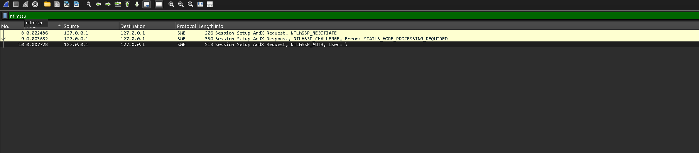
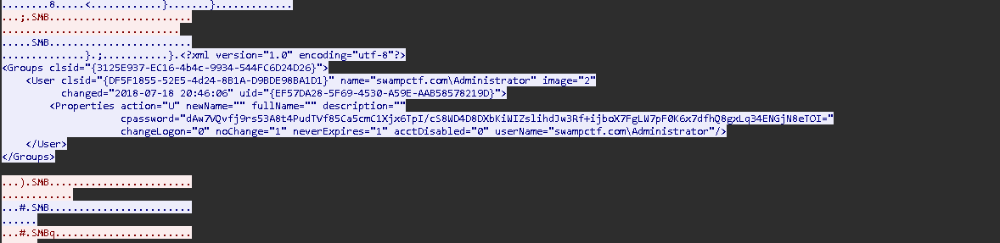
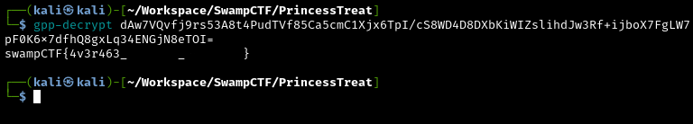

# Preferential Treatment - dtss

> [!NOTE]
> Nous avons un fichier pcap et une consigne "We have an old Windows Server 2008 instance that we lost the password for. Can you see if you can find one in this packet capture?"

--> J'ouvre le fichier gpnightmare.pcap avec wireshark.

--> J'essaie de repérer sur quel protocole d'authentification les échanges ont eu lieu. 

--> Je filtre sur Wireshark avec ntlmssp (NT LAN Manager Security Support Provider), qui est le protocole d'authentification utilisé principalement dans les environnements Windows.



--> Je trouve trois paquets ; le troisième paquet est la requête de Session Setup AndX, qui est la réponse au challenge et permet de s'authentifier. (Pour se renseigner sur le protocole NTLM ==> https://www.crowdstrike.com/fr-fr/cybersecurity-101/identity-protection/windows-ntlm/)

// Clic Droit > Follow > TCP Stream



--> En explorant cette requête je trouves du xml qui renseigne un "cpassword"

```yml
cpassword="dAw7VQvfj9rs53A8t4PudTVf85Ca5cmC1Xjx6TpI/cS8WD4D8DXbKiWIZslihdJw3Rf+ijboX7FgLW7pF0K6x7dfhQ8gxLq34ENGjN8eTOI="
```

// Ce "cpassword" est un mot de passe chiffré en Base64 qui a été stocké dans un fichier XML de GPP, j'utilises gpp-decrypt sur kali qui permet de décoder ce type de mot de passe.



> [!SUCCESS]
> Je trouve le flag : **swampCTF{4v3r463_-------_--------}**
