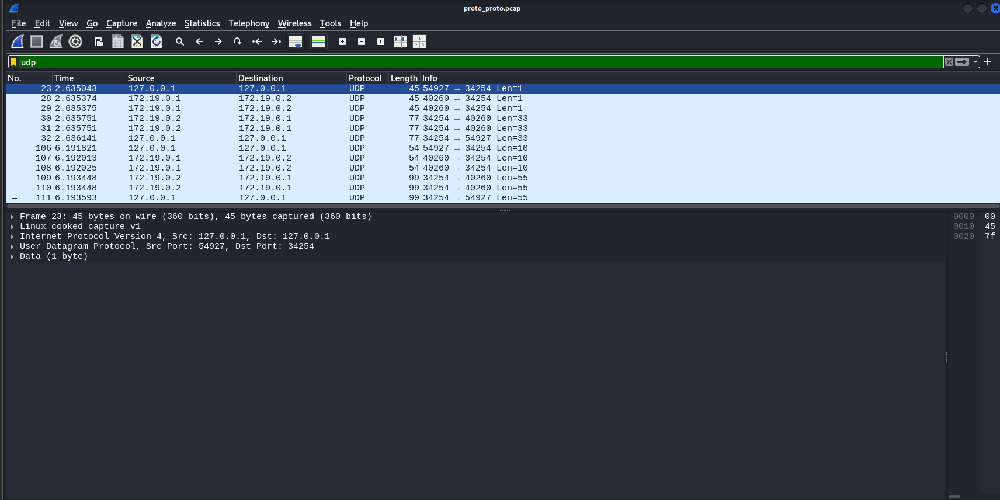
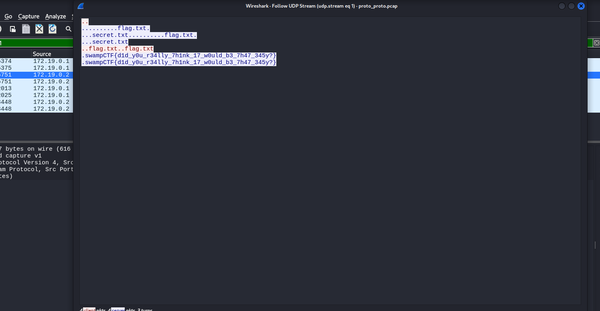
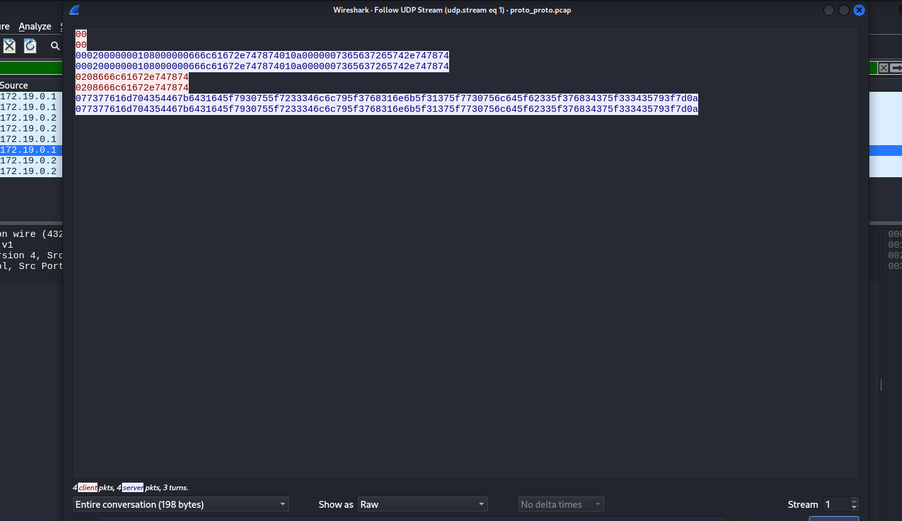
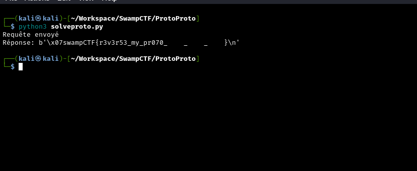

# Proto Proto - dtss
Nous avons un fichier `.pcap`, une consigne et l'adresse d'un serveur :

> "Moto Moto likes you. But not enough to explain how his server works. We got a pcap of the client and server communicating. Can you figure out how the server works and retrieve the flag?"

**Adresse du serveur :** `chals.swampctf.com:44254`

---

En premier temps, j'ouvre le fichier `.pcap` avec Wireshark. D'après la consigne, je déduis que le client et le serveur communiquent via un protocole inconnu. Il faut également comprendre le fonctionnement de ce serveur et sûrement reproduire le même procédé sur le serveur donné.

> [!NOTE]
> En explorant les packets du pcap je remarque que le protocole udp peut être intéressant, je filtre donc les packets avec :  udp



--> Nous pouvons observer des échanges entre deux ips, le client et le serveur :

  - **Client :** `172.19.0.1`
  - **Serveur :** `172.19.0.2`

Je filtre encore pour analyser le trafic pertinent entre les deux ips : ip.addr == 172.19.0.1 && ip.addr == 172.19.0.2
Je prends le troisième paquet et j'analyse le flux UDP (`Clic Droit > Follow > UDP Stream`). Le contenu en mode **ASCII** est :

--> Voici le contenu 



Je suis en mode "ASCII" et je passe en mode "Raw" pour voir les données "brutes" car les "...." en ASCII peuvent représenter des octets non imprimables ou des null bytes.

--> Voici le contenu en mode Raw :



On fait apparaître une chaîne hexadécimale :

```0208666c61672e747874```

--> Voici une décortication de cette chaîne :

```yml
02 : Opcode indiquant une demande (ici une requête de fichier).

08 : Byte indiquant la longueur du nom du fichier qui suit (8 caractères - flag.txt)

66 6c 61 67 2e 74 78 74 : Correspond à la chaîne ASCII "flag.txt"

66 → f

6c → l

61 → a

67 → g

2e → .

74 → t

78 → x

74 → t
```

Cela signifie que le client demande au serveur le fichier `flag.txt` à l'aide de cette chaîne hexadécimale, et le serveur répond avec le contenu du fichier.

--> Il faut donc reproduire ce scénario sur le serveur pour récupérer le vrai flag.

Voici le script qui permet de récupérer le flag sur le vrai serveur :

```python
import socket

HOST = "chals.swampctf.com"
PORT = 44254

def main():
    sock = socket.socket(socket.AF_INET, socket.SOCK_DGRAM)
    req = b"\x02\x08flag.txt"
    print("Requête envoyé")
    sock.sendto(req, (HOST, PORT))
    data, _ = sock.recvfrom(4096)
    print("Réponse:", data)
    sock.close()

if __name__ == "__main__":
    main()
```


Je récupère le flag : ***swampCTF{r3v3r53_my_pr070_---_----_----}***
